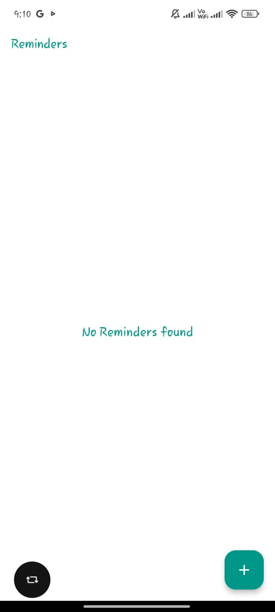
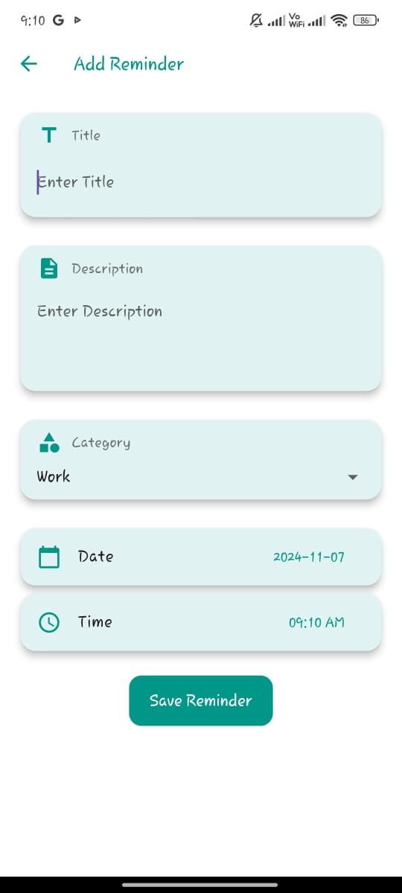
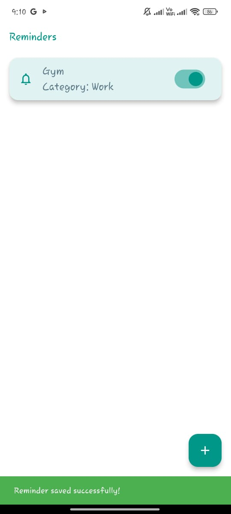

# Reminder App with Notifications ⏰

A **reminder application** built with **Flutter** that stores reminders locally using **SQLite** and sends notification alerts using **Flutter Local Notifications**. This project demonstrates how to manage local databases and trigger notifications for reminders in a Flutter app.



---

## 🚀 Features
- **Add, Edit, and Delete Reminders** 📝  
- **SQLite** for storing reminders locally 🗃️  
- **Flutter Local Notifications** for sending scheduled notifications 📅  
- **Notification when a reminder is due** 🔔  
- **Clean UI with smooth animations** 💡

---

## 📸 Screenshots

| Home Screen      | Add Reminder       | Reminder List       |
|------------------|--------------------|---------------------|
|  |  |  |

---

## 🛠️ Built With
- **Flutter**  
- **Dart**  
- **SQLite** for local data storage  
- **Flutter Local Notifications** for handling scheduled reminders  
- **Provider** for state management (optional, depending on your implementation)

---

## 📂 Project Structure
```plaintext
reminderapp/
│
├── lib/
│   ├── main.dart                 # Entry point of the app
│   ├── models/                   # Data models for the reminder app
│   │   └── reminder.dart         # Reminder model with SQLite integration
│   ├── screens/                  # UI screens
│   │   ├── home_screen.dart      # Home screen UI
│   │   ├── add_reminder_screen.dart # UI for adding reminders
│   │   └── reminder_list_screen.dart # UI for displaying all reminders
│   ├── services/                 # App services (e.g., notifications, SQLite)
│   │   ├── notification_service.dart # Manages local notifications
│   │   └── database_service.dart # Manages SQLite database
├── assets/                       # App assets (icons, screenshots)
│   ├── homescreen.jpeg           # Screenshot of home screen
│   ├── reminderadding.jpeg       # Screenshot of reminder adding screen
│   └── reminderhome.jpeg         # Screenshot of reminder list screen
└── pubspec.yaml                  # Project dependencies
```

---

## 🚀 How to Run Locally
1. **Clone** the repository:
   ```bash
   git clone https://github.com/obaidullah72/reminderapp.git
   cd reminderapp
   ```

2. **Install dependencies**:
   ```bash
   flutter pub get
   ```

3. **Run the app**:
   ```bash
   flutter run
   ```

---

## 🔔 Setting Up Local Notifications
1. Add **Flutter Local Notifications** to your project:
   ```yaml
   dependencies:
     flutter_local_notifications: ^9.0.0
   ```

2. Set up **permissions** for notifications in both Android and iOS. Make sure to follow the [Flutter Local Notifications documentation](https://pub.dev/packages/flutter_local_notifications) for platform-specific setup.

3. Use the `NotificationService` class to schedule notifications at specific times when a reminder is added.

---

## 🌟 Future Improvements
- Add support for **recurring reminders**.  
- Include **push notifications** for cloud-based reminders.  
- Add **priority-based sorting** of reminders.

---

## 🤝 Contributing
Contributions are welcome! Please feel free to submit a **pull request** if you find any issues or want to improve the app.

---

## 🛡️ License
This project is licensed under the **MIT License** – see the [LICENSE](LICENSE) file for details.

---

## 📬 Contact
For any questions or suggestions, reach out to me:

- **GitHub**: [obaidullah72](https://github.com/obaidullah72/)
- **LinkedIn**: [obaidullah72](https://www.linkedin.com/in/obaidullah72/)

---

[](https://visitcount.itsvg.in)

